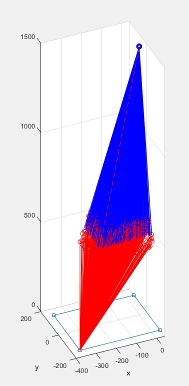
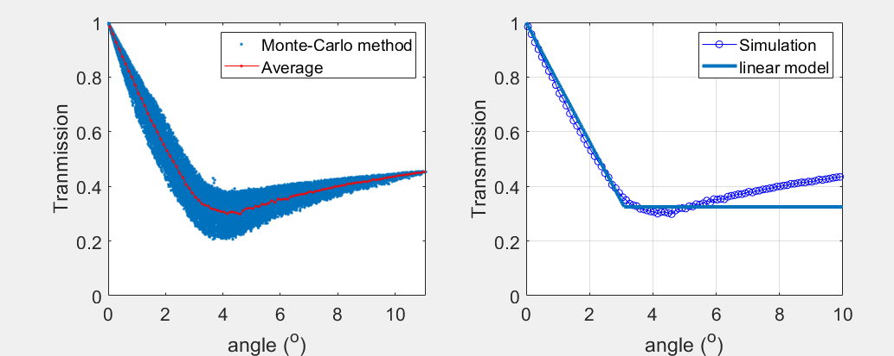

#  Anti-Scatter Grid problem

The Varian Truebeam OBI has an anti-scatter grid during measurement. 

However, the EGS_CBCT program does not have the option to calculate anti-scatter grid.

There are several option we can use.

### 1. Build a series lead strip physical model directly in the EGS_cbct program.

### 2. Edit the egs_cbct.cpp or scoring file

### 3. Use the scatter-kernel-superposition (SKS) method to calculate the anti-scatter grid

# Post process on Anti-Scatter Grid


### Monte-Carlo simulation with anti-scatter grid
A simple Monte-Carlo simulation is made to test the the grid response function. 
Use  ```grid_response_function_MC.m``` to initialize the Monte-Carlo simulation, this code will randomly generate a uniform distribution of scattered photons towards a certain imager local area (pixels). 
The code will determine if the photon has been interacted with the lead strip of the scatter grid, and assign a transmission to every single photon. 
One the photons reach to a certain number (to decrease the statistical uncertainty), we take the average value of the transmission of the simulated pixel and record its scatter angle. 
Next, we referesh  the target pixel and loop over this process. The results is saved to a \*.m file for further process.



This code assumes that: 
* the scattered photons are isotropic or quasi-isotropic.
* the scatter only ocurred within the scaned area. (ignoring the air, and assume the homogeneous scanned phantom)
* the secondary scatter (patient scattered photons get scattered by the lead strips) will be and only be captured by the local pixel.

```grid_response_function.m``` take the simulated results and plot it. A linear fitting curve can also been displayed.
please see the figure below: 



Now, we have figured out the physics origin of the grid response function. 

# Directly modelling the lead strips of the Anti-scatter grids in EGSnrc models

We can also model the lead strips of the anti-scatter grids in the EGSnrc simulations. It's not easy to model 2400 lead strips in EGS, we still achieved this method. 

Use the ```Generate_ASG_Geom_file_prism_method.m``` will generate the lead strips in the grid. 

From a test run, we can see that this method will slow down the simulation at least 30+ times, a typical simulation 2.7 hours will extended to over 80 hours. 

This method seems not practical to solve the anti-scatter grid problem.


The anti-scatter grid with patient phantom, the figure is from egs_view.
