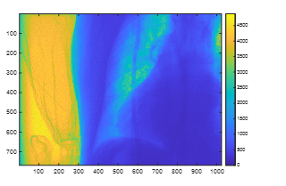

# A short verion 

check function ``` main_cbct_scatter_project ``` have all folders and path defined correctly. 

then run it, and select the working example egsinp file.

wait for a long simulation time, restart if necessary. 

once you got all egsmap files, you have finished the simulation should move to the anti-scatter grid post process.

### Results 

After you run each ```egs_cbct``` simulation, the program will generate a output file (\*.egsmap) that stores the raw projection that captured by the imager. 
The Air Kerma of Ktotal (primary + scatter), Katt (primary), and Kscatt (scatter) of each pixel has been recorded with their uncertainties. 
When we use the IAEA source, the uncertainties is unable to evaluate since the random number generator is not within the egs program. 

You can run ```read_egsmap_parallel.m``` to read the \*.egsmap files into a MATLAB matrix. and visulize it with ```imshow``` or ```imagesc```.
A typical result is show below: 


compare with the raw projection measured by Varian CBCT: 



# EGS_CBCT Simulation Insight

This part expalins how the egs_cbct works in this project.

## Create an example EGS_CBCT input file

#### Rotation 

Define The Rotation of this scan :

```
:start cbct setup:
        orbit = 360.0
        y-rotation = 3.14159 # in radians
:stop cbct setup:
```

#### X-ray light source + Patient phantom

We use the generated IAEA source from blank scan as our X-ray source. 
Define The X-ray source :

```
:start source:
	library 	= iaea_phsp_source
	name 		= iaea_source
	iaea phase space file = D:\IAEA_phsp\Varian_cbct_120kv 
	particle type = all
	# cutout = x1 x2 y1 y2  (optional)
	recycle photons = 10  #number of times to recycle each photon (optional)
:stop source:
```

Use the absolute file path to define the paitent phantom.
Define the Patient phantom: 

```
:start geometry:
    library = egs_ndgeometry
    type    = EGS_XYZGeometry
    name    = phantom
    egsphant file = C:\EGSnrc-master\egs_home\egs_cbct\throaxCauch_305655.egsphant
	  ct ramp = C:\EGSnrc-master\egs_home\egs_cbct\example_thorax.ramp
:stop geometry:
```
and the blank phantom used in calibration:
```
:start geometry:
    library = egs_box
    type    = EGS_box
    name    = blank_phantom
    box size = 40 40 40
    :start media input:
       media = AIR521ICRU
    :stop media input:
:stop geometry:
```

#### Variance Reduction Technique - Fix splitting

We define the split number of each scattered photons. This will increase the simulation efficiency significantly.

```
:start variance reduction:
   scoring type =  forced_detection  # scores photons AIMED at scoring plane  
   delta transport medium = AIR521ICRU # AIR521ICRU LUNG521ICRU ICRUTISSUE521ICRU ICRPBONE521ICRU
   FS splitting = 180 300 # Np Ns
:stop variance reduction:
```


#### Scoring plane

X-ray detector (ideal). 

```
:start scoring options:
    calculation type = planar 
      :start planar scoring:
           #minimum Kscat fraction = 0.5
           surrounding medium = AIR521ICRU   # AIR521ICRU or VACUUM 
           screen resolution = 192 256   # 40 cm X 30 cm screen(Yreso)x(Xreso)
           voxel size = 0.1552 0.1552  # This needs to be tested
           :start transformation:        
              translation = 16 0 50
              rotation = 0 0 0
           :stop transformation:
            # Uses file provided in the distribution
            muen file = C:\EGSnrc-master\egs_home\egs_fac\examples\muen_air.data
     :stop planar scoring:
:stop scoring options:
```
#### Histories

The number of photons that we simulate in the EGS_cbct

```
:start run control:
    ncase =  2e8
    calculation = first
:stop run control:
```

Once we create this example EGS_CBCT input file, we can run it and have a look of the simulation result.

## Generate a batch of egsinp file ( ~895 projections + 1 blank scan)

we use the following function:

```
generate_cbct_rotation_file(rotation,step,FileName1,FileName2,mode)
```

## Parallel computing (in our computer, we use 30 threads, with 32 maximum )

It would take around a week to do the whole set of simulations. Sometimes, the MATLAB will encounter into some issue after a few days. 
All you need to do is close it, restart the system, and run this code again (make sure you adjusted mode to "continue a scan mode", don't run the "new mode"), it will skip the finished simulations and continue the scan. 

So you just lose the result that haven't finished (may a few hours but not a lot). After the simulation is done, you should get enough \*.egsmap files correponding to the total number of measured projections

```
parpool(30)
parfor file(1):file(895)
	dos(file)
end
```

## Data process 

The data process can also be done use the parallel computing. 

We need to convert the acsii info to matrix in MATLAB. 
